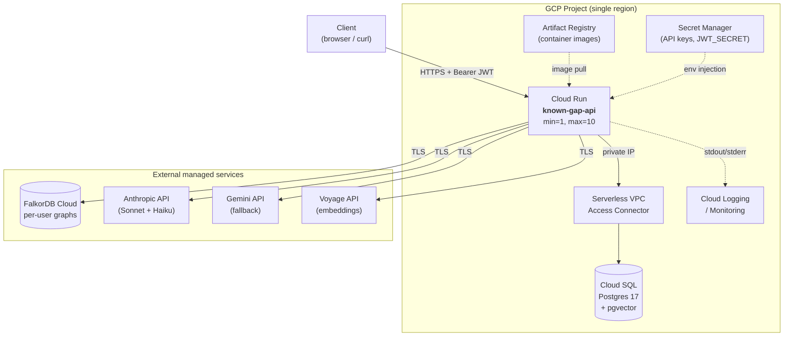
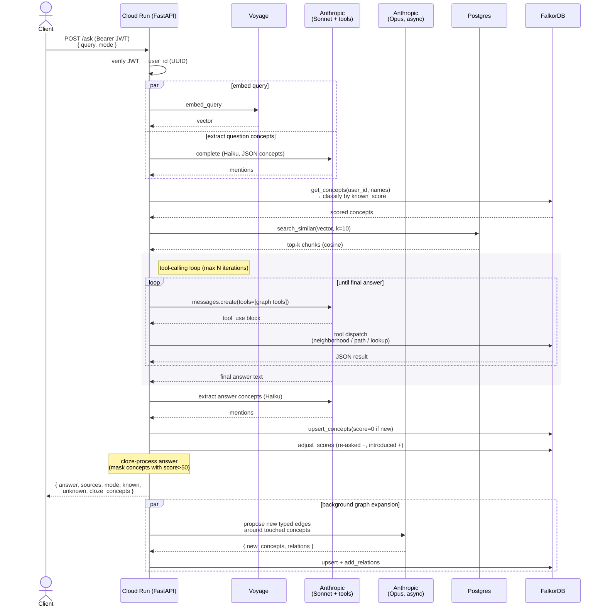

# Known Gap — Architecture

Known Gap is a knowledge-gap-aware Q&A service. It combines a standard RAG
pipeline (pgvector) with a per-user knowledge graph (FalkorDB). The `/ask`
endpoint accepts a `mode` — **normal**, **learning**, or **concise** — and the
selected strategy shapes both the prompt and the response so answers adapt to
what the user is known to have seen before.

---

## 1. Deployment Topology



The deployable unit is a single Cloud Run service. Postgres is inside the VPC
and only reachable from Cloud Run via a Serverless VPC Access Connector (no
public IP). Everything else is a third-party HTTPS dependency.

---

## 2. Component Responsibilities

Each component is evaluated against the three production-readiness axes from
the assignment: **availability**, **scalability**, **cost optimisation**.

| Component | Service | Role | Availability | Scalability | Cost stance |
| --- | --- | --- | --- | --- | --- |
| API | **Cloud Run** | Stateless FastAPI; serves `/ingest` and `/ask` | Managed multi-zone within region; automatic instance replacement | Auto 0→N per request rate; min=1 in demo to avoid cold starts | Pay-per-request + one warm instance; scales to zero when quiet |
| Relational + vectors | **Cloud SQL (Postgres 17)** | `documents`, `chunks`, HNSW index over `VECTOR(1024)` | Single-zone for demo; flip to HA (regional) for prod with one setting | Start `db-f1-micro` / `db-g1-small`; vertical bump or read replicas later | Smallest burstable tier is adequate for demo traffic |
| Container images | **Artifact Registry** | Versioned Docker images built in CI | Regional, GA | N/A — cold storage | Per-GB-month; trivial for a single image |
| Secrets | **Secret Manager** | API keys, `JWT_SECRET`, DB password | Replicated automatically | N/A | Per-secret-version; handful of secrets |
| Private path | **Serverless VPC Access Connector** | Only way Cloud Run can reach Cloud SQL over private IP | Fully managed | Auto throughput scale | Per-hour + per-GB; small but non-zero idle cost |
| Observability | **Cloud Logging / Monitoring** | Structured stdout/stderr + built-in metrics | GA | N/A | Pay-per-GB-ingested |
| Knowledge graph | **FalkorDB Cloud** (external) | Per-user Concept graphs, OpenCypher queries | Vendor SLA | Vendor-managed vertical scale | Vendor pricing; isolated from GCP cost |

**Availability stance.** Cloud Run and Cloud SQL both sit in one region; both
can flip to multi-region / HA by configuration if the demo graduates. FalkorDB
Cloud availability is an external SLA — an outage there degrades `/ask` but
does not take the service down (requests to `/ingest` and normal-mode answers
still succeed if we loosen the graph write; v1 keeps the write mandatory, see
§9).

**Scalability stance.** The hot path is stateless; horizontal scale comes from
Cloud Run. Read pressure lands on pgvector similarity search — HNSW is already
in place and Cloud SQL read replicas are the first lever if needed. The LLM
and embedding providers are elastic by design.

**Cost stance.** Scale-to-zero is the cheapest shape for a demo. The two
always-on costs are Cloud SQL and the VPC Connector; both are on the smallest
tier. LLM calls dominate variable cost — which is why concept extraction
defaults to Haiku (cheap) while answer generation defaults to Sonnet 4.6, and
why the Gemini fallback is gated to transient failures only (no silent
double-spend on permanent errors).

---

## 3. Request Flow (`/ask`)

The `/ask` flow is a **tool-calling loop**: the answering LLM is given a
small set of read-only graph tools (LangChain `BaseTool` instances) and
decides at runtime when to call them. The loop terminates when the model
produces a final text response or hits an iteration cap.



The synchronous-write contract is preserved for **score updates and node
upserts**: by the time `/ask` returns, the user's graph already reflects the
exchange (so the next call sees the new scores). The **graph expander** is
fire-and-forget: it asks an Opus-class model to densify the graph with new
typed edges and runs in `asyncio.create_task` after the response is sent.

Each strategy (`normal`, `learning`, `concise`) reuses the same tool-enabled
answerer; only the system prompt changes. `learning` mode additionally runs
the `cloze_processor` over the final text to mask the concepts the user
already owns (`known_score > 50`) as `<cloze concept="…">…</cloze>` spans —
the frontend renders those as fill-in-the-blanks.

---

## 4. Security & Secrets

- **JWT.** HS256 with a shared secret between this backend and the frontend
  that mints the token. Required claims: `sub` (user_id UUID), `iat`, `exp`.
  Both endpoints require a bearer token. `INVALID_TOKEN` and `TOKEN_EXPIRED`
  surface as HTTP 401.
- **Secret Manager.** `ANTHROPIC_API_KEY`, `VOYAGE_API_KEY`, `GEMINI_API_KEY`,
  `FALKORDB_PASSWORD`, `JWT_SECRET`, and the Cloud SQL password are all
  injected as Cloud Run environment variables at deploy time and never
  committed.
- **Private-IP Postgres.** Cloud SQL has no public IP; Cloud Run reaches it
  through the Serverless VPC Access Connector only.
- **No PII in the knowledge graph.** The graph stores concept names and
  counters, not message history.

---

## 5. Code Architecture (Clean Architecture + Hexagonal)

```mermaid
flowchart TB
    subgraph api["api/ — HTTP boundary"]
        endpoints["endpoints/ask.py<br/>endpoints/ingest.py"]
        schemas["schemas/"]
        deps["dependencies.py"]
    end

    subgraph application["application/"]
        usecases["use_cases/<br/>ask · ingest_document"]
        strategies["strategies/<br/>normal · learning · concise"]
        services["services/<br/>chunker · concept_extractor<br/>knowledge_classifier<br/>tool_enabled_answerer<br/>cloze_processor · score_updater<br/>graph_expander · answer_post_processor"]
        tools["tools/<br/>graph_tools (LangChain @tool)"]
    end

    subgraph domain["domain/ — pure, no external deps"]
        models["models/<br/>Concept · ConceptRelation<br/>ConceptNeighborhood"]
        repos["repositories/ (ports)"]
        domservices["services/<br/>LLMProvider · EmbeddingProvider<br/>DocumentParser · GraphExpert (ports)"]
    end

    subgraph infra["infrastructure/ — adapters"]
        db["db/<br/>Postgres · pgvector"]
        emb["embeddings/ (Voyage)"]
        llm["llm/<br/>Anthropic · Gemini · Fallback · Factory<br/>AnthropicGraphExpert"]
        graph["graph/ (FalkorDB)"]
        parsing["parsing/ (pdf/md/txt)"]
        auth["auth/ (JWT verifier)"]
    end

    endpoints --> deps
    deps --> usecases
    usecases --> strategies
    usecases --> services
    usecases --> tools
    services --> domservices
    services --> repos
    tools --> repos
    usecases --> repos
    db -. implements .-> repos
    graph -. implements .-> repos
    emb -. implements .-> domservices
    llm -. implements .-> domservices
    parsing -. implements .-> domservices
```

Dependencies point inward: `infrastructure` and `api` depend on `application`
which depends on `domain`. `domain` never imports from anywhere else. The
ports in `domain/repositories/` and `domain/services/` are the only
"contracts" that adapters must satisfy — that's the seam that keeps Postgres,
Voyage, Anthropic, and FalkorDB swappable.

---

## 6. Design Patterns

| Pattern | Where it lives | Why |
| --- | --- | --- |
| **Repository** | `domain/repositories/{document,chunk,user_graph}_repository.py` · `infrastructure/db/postgres_*.py` · `infrastructure/graph/falkordb_user_graph_repository.py` | Storage engines (Postgres / FalkorDB) never leak into application or domain code |
| **Factory** | `infrastructure/embeddings/factory.py` · `infrastructure/llm/factory.py` | Selects and composes providers from settings. `LLMProviderFactory` has three entry points (`from_settings` for answering, `for_concept_extraction` for Haiku, `for_graph_expert` for Opus) so each use case gets the right-sized model |
| **Strategy** | `application/strategies/{base,normal,learning,concise}.py` | Each mode owns its own prompt; all share the same tool-enabled answerer. Adding a mode is a new file plus a `dict` entry in DI — no handler changes |
| **Tool (LangChain)** | `application/tools/graph_tools.py` | Graph operations (`lookup_user_known_concepts`, `get_concept_neighborhood`, `find_path_between_concepts`) are exposed as portable LangChain `BaseTool`s, bound to a per-request `(graph, user_id)` context. Any LangChain-speaking runtime can pick them up |
| **Background task** | `application/services/graph_expander.py` | The Graph Expert (Opus) runs in `asyncio.create_task` after the user-facing response is sent, so densification cost never lands on the request critical path |

A **fallback decorator** (`infrastructure/llm/fallback_provider.py`) wraps the
primary LLM with a secondary and only retries on `TransientException` —
permanent errors propagate so the caller fails fast. The `ToolEnabledAnswerer`
also degrades gracefully: on transient Anthropic failure during the tool
loop it falls back to a plain (no-tools) completion via the same fallback
chain.

### Tool-calling loop

`ToolEnabledAnswerer` runs Anthropic's native `messages.create(tools=…)` API
in a loop:

1. Call the model with the system prompt, conversation, and tool schemas
   (LangChain tools converted to Anthropic's input-schema format).
2. If the model returns `stop_reason="tool_use"`, dispatch each tool call
   asynchronously, append the results to `messages`, and loop.
3. Otherwise return the assembled text.

The model is in charge — it decides whether to call any tools, in which
order, and with what arguments. The tools themselves are read-only;
graph **writes** stay on the deterministic post-answer path so prompt
injection cannot corrupt a user's graph.

---

## 7. Data Model

### Postgres (RAG corpus)

```sql
CREATE TABLE documents (
    id            UUID PRIMARY KEY,
    filename      TEXT NOT NULL,
    content_type  TEXT NOT NULL,
    byte_size     INTEGER NOT NULL,
    ingested_at   TIMESTAMPTZ NOT NULL DEFAULT now()
);

CREATE TABLE chunks (
    id           UUID PRIMARY KEY,
    document_id  UUID NOT NULL REFERENCES documents(id) ON DELETE CASCADE,
    chunk_index  INTEGER NOT NULL,
    content      TEXT NOT NULL,
    embedding    VECTOR(1024),
    created_at   TIMESTAMPTZ NOT NULL DEFAULT now()
);

CREATE INDEX chunks_embedding_hnsw_idx
    ON chunks USING hnsw (embedding vector_cosine_ops);
```

Documents are global — `/ingest` is authenticated but does not partition by
user. Only the knowledge graph is per-user.

### FalkorDB (knowledge graph)

One graph per user, named `user_<uuid.hex>`. A single node label and a
single edge label, both written via OpenCypher:

```cypher
(:Concept {
    canonical_name: string,   // lowercased, trimmed — the identity
    display_name:   string,
    description:    string,
    domain:         string | null,
    known_score:    int,      // [0, 100], clamped on every write
    first_seen:     timestamp,
    last_seen:      timestamp
})

(a:Concept)-[:RELATES_TO {
    relation_type: string,   // "is_a" / "uses" / "depends_on" / ...
    rationale:     string,   // one-line LLM justification
    created_at:    timestamp
}]->(b:Concept)
```

`known_score` lives in `[0, 100]` and is the heart of the system:

- **0** on first sight (extracted from a doc or answer).
- **+`KNOWN_SCORE_INCREMENT`** when a concept is introduced via an
  answer the user did not ask about — this is reinforcement.
- **−`KNOWN_SCORE_DECREMENT`** when a concept is **re-asked** while
  already known (`> KNOWN_SCORE_THRESHOLD`) — the user appears to have
  forgotten, so we drop the score.
- **`> KNOWN_SCORE_THRESHOLD`** (default 50) is the boundary at which
  a concept becomes a candidate for cloze masking.

Edges are typed and directed; the `relation_type` is **LLM-defined**
(snake_case verb phrases) and stored as a property so Cypher queries
remain fully parameterizable. The schema deliberately uses a single
edge label so traversal-on-anything queries (`MATCH (a)-[:RELATES_TO]-`)
stay simple while the *semantics* live in the property.

---

## 8. Build, Ship, Run (CI/CD Outline)

The GitHub Actions workflow (`.github/workflows/ci.yml`) already runs `uv
sync`, `ruff`, `ruff format --check`, `ty`, and `pytest` on every push. The
Phase 7 extension will add:

1. Build the runtime Docker image (the final stage of the multi-stage
   Dockerfile — no `uv`, no build tools, minimal attack surface).
2. Push to Artifact Registry, tagged with the commit SHA.
3. Deploy to Cloud Run with `--image <sha>` and `--set-secrets` sourcing from
   Secret Manager.

No persistent state in the container — the Dockerfile's runtime stage only
carries the venv plus `src/` and `main.py`, and drops to a non-root user.

---

## 9. Future Work

- **Ideal knowledge graph + gap discovery.** Build an "ideal" graph from the
  same dataset used for ingestion (concept extraction on each chunk, concept
  merging across chunks). Comparing the user's graph to the ideal graph for a
  document surfaces concrete "what you haven't seen yet" gaps — the natural
  next workflow on top of the infrastructure already in place.
- **Concept embeddings + fuzzy match.** `"recursion"` and `"recursive
  function"` are the same concept under any reasonable reader; exact-name
  matching misses this. Add a concept-embedding index in pgvector (or
  FalkorDB's vector index) and use cosine similarity before declaring a
  concept "unknown".
- **LangSmith tracing.** Tools are already LangChain-native; switching the
  answerer to `langchain-anthropic.ChatAnthropic.bind_tools()` enables
  full LangSmith traces for free. Enable when the cost is justified.
- **MCP server.** The same tool surface can be exposed via the Model
  Context Protocol so other LLM clients (Claude Desktop, IDE agents)
  talk to the user's knowledge graph directly.
- **Rich JWT enforcement.** Verify `iss` and `aud`, support RS256 with a
  JWKS-rotated public key, and gate `/ingest` by a separate role if the
  corpus becomes truly shared.
- **Observability.** Emit structured logs (already using `structlog`),
  per-mode latency histograms, and LLM-cost counters to Cloud Monitoring.

---

## 10. Known Limitations

- **Synchronous score updates** land the FalkorDB write on the critical path
  of every `/ask`. Edge densification (the expensive part) is already
  background; node upserts and score adjustments are kept synchronous so the
  next call sees consistent state.
- **Concept extraction quality** is bounded by the LLM. No rule-based NER
  fallback; malformed JSON raises `CONCEPT_EXTRACTION_PARSE_ERROR`.
- **Exact canonical-name matching** misses near-synonyms — see §9's fuzzy
  match note.
- **Tool-calling cost.** Each `/ask` may make multiple Anthropic round-trips
  if the model decides to use tools repeatedly. The `TOOL_MAX_ITERATIONS`
  setting bounds the worst case.
- **Graph expert is fire-and-forget.** A failure (or a slow Opus run) does
  not block the response, but it also produces no visible error to the user.
  Surface async-task health via Cloud Monitoring once observability lands.
- **No rate limiting or per-user quota** on either endpoint.
- **Embedding batch size** is bounded by settings; a very large document
  still makes one Voyage request per batch sequentially.
- **No document deletion or re-ingest** endpoint — chunks are append-only.
