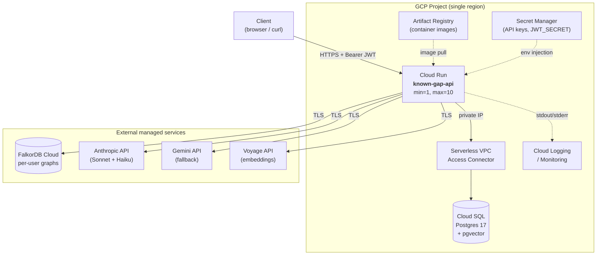
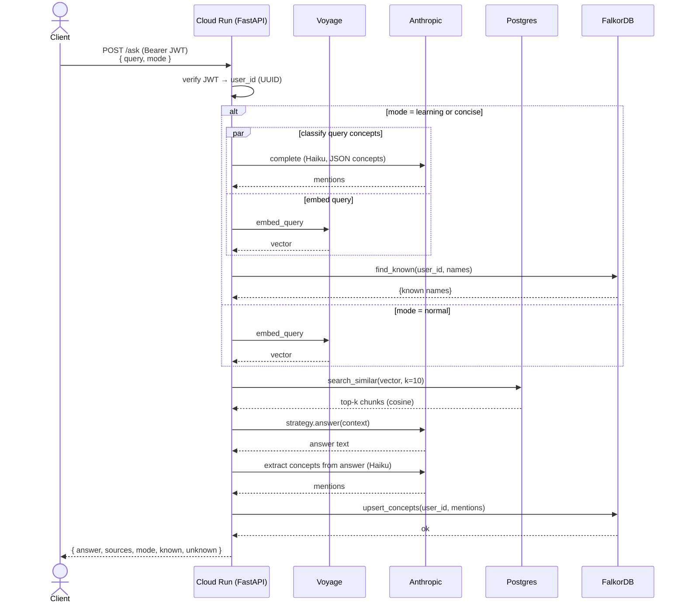

# Known Gap — Architecture

Known Gap is a knowledge-gap-aware Q&A service. It combines a standard RAG
pipeline (pgvector) with a per-user knowledge graph (FalkorDB). The `/ask`
endpoint accepts a `mode` — **normal**, **learning**, or **concise** — and the
selected strategy shapes both the prompt and the response so answers adapt to
what the user is known to have seen before.

---

## 1. Deployment Topology



The deployable unit is a single Cloud Run service. Postgres is inside the VPC
and only reachable from Cloud Run via a Serverless VPC Access Connector (no
public IP). Everything else is a third-party HTTPS dependency.

---

## 2. Component Responsibilities

Each component is evaluated against the three production-readiness axes from
the assignment: **availability**, **scalability**, **cost optimisation**.

| Component | Service | Role | Availability | Scalability | Cost stance |
| --- | --- | --- | --- | --- | --- |
| API | **Cloud Run** | Stateless FastAPI; serves `/ingest` and `/ask` | Managed multi-zone within region; automatic instance replacement | Auto 0→N per request rate; min=1 in demo to avoid cold starts | Pay-per-request + one warm instance; scales to zero when quiet |
| Relational + vectors | **Cloud SQL (Postgres 17)** | `documents`, `chunks`, HNSW index over `VECTOR(1024)` | Single-zone for demo; flip to HA (regional) for prod with one setting | Start `db-f1-micro` / `db-g1-small`; vertical bump or read replicas later | Smallest burstable tier is adequate for demo traffic |
| Container images | **Artifact Registry** | Versioned Docker images built in CI | Regional, GA | N/A — cold storage | Per-GB-month; trivial for a single image |
| Secrets | **Secret Manager** | API keys, `JWT_SECRET`, DB password | Replicated automatically | N/A | Per-secret-version; handful of secrets |
| Private path | **Serverless VPC Access Connector** | Only way Cloud Run can reach Cloud SQL over private IP | Fully managed | Auto throughput scale | Per-hour + per-GB; small but non-zero idle cost |
| Observability | **Cloud Logging / Monitoring** | Structured stdout/stderr + built-in metrics | GA | N/A | Pay-per-GB-ingested |
| Knowledge graph | **FalkorDB Cloud** (external) | Per-user Concept graphs, OpenCypher queries | Vendor SLA | Vendor-managed vertical scale | Vendor pricing; isolated from GCP cost |

**Availability stance.** Cloud Run and Cloud SQL both sit in one region; both
can flip to multi-region / HA by configuration if the demo graduates. FalkorDB
Cloud availability is an external SLA — an outage there degrades `/ask` but
does not take the service down (requests to `/ingest` and normal-mode answers
still succeed if we loosen the graph write; v1 keeps the write mandatory, see
§9).

**Scalability stance.** The hot path is stateless; horizontal scale comes from
Cloud Run. Read pressure lands on pgvector similarity search — HNSW is already
in place and Cloud SQL read replicas are the first lever if needed. The LLM
and embedding providers are elastic by design.

**Cost stance.** Scale-to-zero is the cheapest shape for a demo. The two
always-on costs are Cloud SQL and the VPC Connector; both are on the smallest
tier. LLM calls dominate variable cost — which is why concept extraction
defaults to Haiku (cheap) while answer generation defaults to Sonnet 4.6, and
why the Gemini fallback is gated to transient failures only (no silent
double-spend on permanent errors).

---

## 3. Request Flow (`/ask`)



The graph write on the return trip is **synchronous** by design — the user's
graph always reflects the exchange they just saw, which is the whole premise
of the service.

---

## 4. Security & Secrets

- **JWT.** HS256 with a shared secret between this backend and the frontend
  that mints the token. Required claims: `sub` (user_id UUID), `iat`, `exp`.
  Both endpoints require a bearer token. `INVALID_TOKEN` and `TOKEN_EXPIRED`
  surface as HTTP 401.
- **Secret Manager.** `ANTHROPIC_API_KEY`, `VOYAGE_API_KEY`, `GEMINI_API_KEY`,
  `FALKORDB_PASSWORD`, `JWT_SECRET`, and the Cloud SQL password are all
  injected as Cloud Run environment variables at deploy time and never
  committed.
- **Private-IP Postgres.** Cloud SQL has no public IP; Cloud Run reaches it
  through the Serverless VPC Access Connector only.
- **No PII in the knowledge graph.** The graph stores concept names and
  counters, not message history.

---

## 5. Code Architecture (Clean Architecture + Hexagonal)

```mermaid
flowchart TB
    subgraph api["api/ — HTTP boundary"]
        endpoints["endpoints/ask.py<br/>endpoints/ingest.py"]
        schemas["schemas/"]
        deps["dependencies.py"]
    end

    subgraph application["application/"]
        usecases["use_cases/<br/>ask · ingest_document"]
        strategies["strategies/<br/>normal · learning · concise"]
        services["services/<br/>chunker · concept_extractor<br/>knowledge_classifier<br/>answer_post_processor"]
    end

    subgraph domain["domain/ — pure, no external deps"]
        models["models/"]
        repos["repositories/ (ports)"]
        domservices["services/<br/>LLMProvider · EmbeddingProvider<br/>DocumentParser (ports)"]
    end

    subgraph infra["infrastructure/ — adapters"]
        db["db/<br/>Postgres · pgvector"]
        emb["embeddings/ (Voyage)"]
        llm["llm/<br/>Anthropic · Gemini · Fallback · Factory"]
        graph["graph/ (FalkorDB)"]
        parsing["parsing/ (pdf/md/txt)"]
        auth["auth/ (JWT verifier)"]
    end

    endpoints --> deps
    deps --> usecases
    usecases --> strategies
    usecases --> services
    services --> domservices
    usecases --> repos
    db -. implements .-> repos
    graph -. implements .-> repos
    emb -. implements .-> domservices
    llm -. implements .-> domservices
    parsing -. implements .-> domservices
```

Dependencies point inward: `infrastructure` and `api` depend on `application`
which depends on `domain`. `domain` never imports from anywhere else. The
ports in `domain/repositories/` and `domain/services/` are the only
"contracts" that adapters must satisfy — that's the seam that keeps Postgres,
Voyage, Anthropic, and FalkorDB swappable.

---

## 6. Design Patterns

| Pattern | Where it lives | Why |
| --- | --- | --- |
| **Repository** | `domain/repositories/{document,chunk,user_graph}_repository.py` · `infrastructure/db/postgres_*.py` · `infrastructure/graph/falkordb_user_graph_repository.py` | Storage engines (Postgres / FalkorDB) never leak into application or domain code |
| **Factory** | `infrastructure/embeddings/factory.py` · `infrastructure/llm/factory.py` | Selects and composes providers from settings. `LLMProviderFactory` has two entry points (`from_settings` for generation, `for_concept_extraction` for Haiku) so each use case gets the right-sized model |
| **Strategy** | `application/strategies/{base,normal,learning,concise}.py` | Each mode owns its own prompt and its response shape. Adding a mode is a new file plus a `dict` entry in DI — no handler changes |

A **fallback decorator** (`infrastructure/llm/fallback_provider.py`) wraps the
primary LLM with a secondary and only retries on `TransientException` —
permanent errors propagate so the caller fails fast.

---

## 7. Data Model

### Postgres (RAG corpus)

```sql
CREATE TABLE documents (
    id            UUID PRIMARY KEY,
    filename      TEXT NOT NULL,
    content_type  TEXT NOT NULL,
    byte_size     INTEGER NOT NULL,
    ingested_at   TIMESTAMPTZ NOT NULL DEFAULT now()
);

CREATE TABLE chunks (
    id           UUID PRIMARY KEY,
    document_id  UUID NOT NULL REFERENCES documents(id) ON DELETE CASCADE,
    chunk_index  INTEGER NOT NULL,
    content      TEXT NOT NULL,
    embedding    VECTOR(1024),
    created_at   TIMESTAMPTZ NOT NULL DEFAULT now()
);

CREATE INDEX chunks_embedding_hnsw_idx
    ON chunks USING hnsw (embedding vector_cosine_ops);
```

Documents are global — `/ingest` is authenticated but does not partition by
user. Only the knowledge graph is per-user.

### FalkorDB (knowledge graph)

One graph per user, named `user_<uuid.hex>`. Single node label:

```cypher
(:Concept {
    canonical_name:     string,   // lowercased, trimmed — the identity
    display_name:       string,
    description:        string,
    domain:             string | null,
    confidence:         float,    // 0.3 on first mention, +0.1 on re-mention, capped at 1.0
    times_encountered:  int,
    first_seen:         timestamp,
    last_seen:          timestamp
})
```

No edges yet — concepts-only is enough for v1 (see §9).

---

## 8. Build, Ship, Run (CI/CD Outline)

The GitHub Actions workflow (`.github/workflows/ci.yml`) already runs `uv
sync`, `ruff`, `ruff format --check`, `ty`, and `pytest` on every push. The
Phase 7 extension will add:

1. Build the runtime Docker image (the final stage of the multi-stage
   Dockerfile — no `uv`, no build tools, minimal attack surface).
2. Push to Artifact Registry, tagged with the commit SHA.
3. Deploy to Cloud Run with `--image <sha>` and `--set-secrets` sourcing from
   Secret Manager.

No persistent state in the container — the Dockerfile's runtime stage only
carries the venv plus `src/` and `main.py`, and drops to a non-root user.

---

## 9. Future Work

- **Ideal knowledge graph + gap discovery.** Build an "ideal" graph from the
  same dataset used for ingestion (concept extraction on each chunk, concept
  merging across chunks). Comparing the user's graph to the ideal graph for a
  document surfaces concrete "what you haven't seen yet" gaps — the natural
  next workflow on top of the infrastructure already in place.
- **Triples, not just concepts.** Extracting `(subject, predicate, object)`
  triples instead of bare concepts yields relationships. That makes the "gap"
  analysis richer (missing connections, not just missing nodes) and makes
  learning-mode tagging smarter (the LLM could mark entire known-relations).
- **Concept embeddings + fuzzy match.** `"recursion"` and `"recursive
  function"` are the same concept under any reasonable reader; exact-name
  matching misses this. Add a concept-embedding index in pgvector (or
  FalkorDB's vector index) and use cosine similarity before declaring a
  concept "unknown".
- **Rich JWT enforcement.** Verify `iss` and `aud`, support RS256 with a
  JWKS-rotated public key, and gate `/ingest` by a separate role if the
  corpus becomes truly shared.
- **Observability.** Emit structured logs (already using `structlog`),
  per-mode latency histograms, and LLM-cost counters to Cloud Monitoring.

---

## 10. Known Limitations

- **Synchronous graph writes** land the FalkorDB upsert on the critical path
  of every `/ask`. Acceptable for the project's scale; would become a tail-
  latency issue in production.
- **Concept extraction quality** is bounded by the LLM. No rule-based NER
  fallback; malformed JSON raises `CONCEPT_EXTRACTION_PARSE_ERROR`.
- **Exact canonical-name matching** misses near-synonyms — see §9's fuzzy
  match note.
- **No rate limiting or per-user quota** on either endpoint.
- **Embedding batch size** is bounded by settings; a very large document
  still makes one Voyage request per batch sequentially.
- **No document deletion or re-ingest** endpoint — chunks are append-only.
